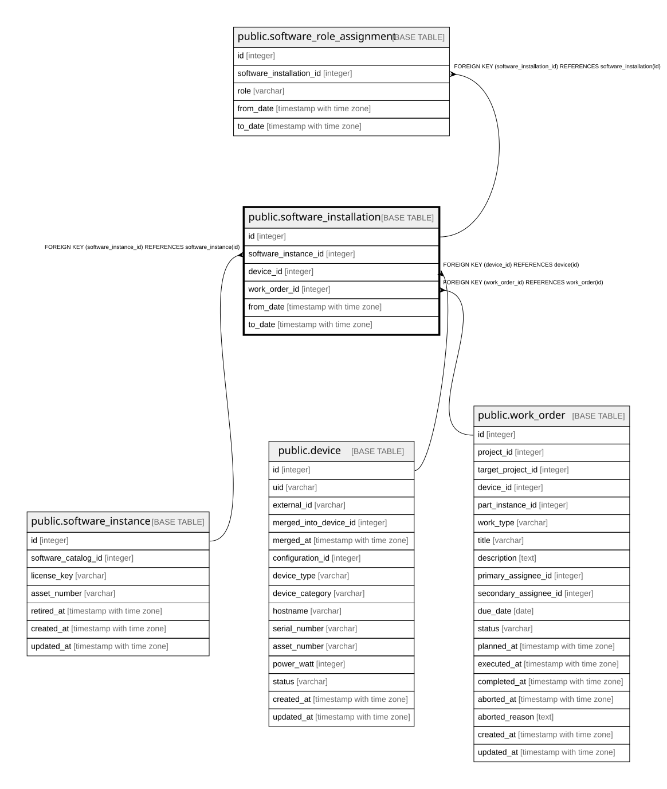

# public.software_installation

## Description

ソフトウェアのインストール — **履歴テーブル**（9.4）。`to_date IS NULL` が現在有効な行。  
**1つのインスタンスが同時に2台へ入ることはない**ため現行行に部分ユニークを張る。  

## Columns

| Name | Type | Default | Nullable | Children | Parents | Comment |
| ---- | ---- | ------- | -------- | -------- | ------- | ------- |
| id | integer |  | false | [public.software_role_assignment](public.software_role_assignment.md) |  |  |
| software_instance_id | integer |  | false |  | [public.software_instance](public.software_instance.md) |  |
| device_id | integer |  | false |  | [public.device](public.device.md) |  |
| work_order_id | integer |  | true |  | [public.work_order](public.work_order.md) | 11章。**先行して作った履歴テーブルと違い、ここは外部キーを張れている**（24.3）  |
| from_date | timestamp with time zone |  | false |  |  |  |
| to_date | timestamp with time zone |  | true |  |  | null が現在有効な行 |

## Constraints

| Name | Type | Definition |
| ---- | ---- | ---------- |
| software_installation_device_id_not_null | n | NOT NULL device_id |
| software_installation_from_date_not_null | n | NOT NULL from_date |
| software_installation_id_not_null | n | NOT NULL id |
| software_installation_software_instance_id_not_null | n | NOT NULL software_instance_id |
| software_installation_device_id_fkey | FOREIGN KEY | FOREIGN KEY (device_id) REFERENCES device(id) |
| software_installation_work_order_id_fkey | FOREIGN KEY | FOREIGN KEY (work_order_id) REFERENCES work_order(id) |
| software_installation_software_instance_id_fkey | FOREIGN KEY | FOREIGN KEY (software_instance_id) REFERENCES software_instance(id) |
| software_installation_pkey | PRIMARY KEY | PRIMARY KEY (id) |

## Indexes

| Name | Definition |
| ---- | ---------- |
| software_installation_pkey | CREATE UNIQUE INDEX software_installation_pkey ON public.software_installation USING btree (id) |
| idx_software_installation_instance | CREATE INDEX idx_software_installation_instance ON public.software_installation USING btree (software_instance_id) |
| idx_software_installation_device | CREATE INDEX idx_software_installation_device ON public.software_installation USING btree (device_id) |
| idx_software_installation_work_order | CREATE INDEX idx_software_installation_work_order ON public.software_installation USING btree (work_order_id) |
| uq_software_installation_current | CREATE UNIQUE INDEX uq_software_installation_current ON public.software_installation USING btree (software_instance_id) WHERE (to_date IS NULL) |

## Relations

---

> Generated by [tbls](https://github.com/k1LoW/tbls)
