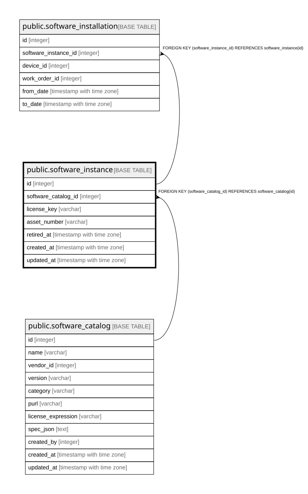

# public.software_instance

## Description

ソフトウェアの固有のインストール単位（9.3）。**バージョンアップを跨いで引き継がれる固有情報**を持つ。  
**`status` を持たない**（9.4.1）。インストール状態は SOFTWARE_INSTALLATION から導出する。  

## Columns

| Name | Type | Default | Nullable | Children | Parents | Comment |
| ---- | ---- | ------- | -------- | -------- | ------- | ------- |
| id | integer |  | false | [public.software_installation](public.software_installation.md) |  |  |
| software_catalog_id | integer |  | false |  | [public.software_catalog](public.software_catalog.md) |  |
| license_key | varchar |  | true |  |  |  |
| asset_number | varchar |  | true |  |  |  |
| retired_at | timestamp with time zone |  | true |  |  | null = 保有中。**導出できないのはここだけ。** 未インストールの在庫と失効済みは、インストール履歴からは区別がつかない  |
| created_at | timestamp with time zone |  | false |  |  |  |
| updated_at | timestamp with time zone |  | false |  |  |  |

## Constraints

| Name | Type | Definition |
| ---- | ---- | ---------- |
| software_instance_software_catalog_id_fkey | FOREIGN KEY | FOREIGN KEY (software_catalog_id) REFERENCES software_catalog(id) |
| software_instance_pkey | PRIMARY KEY | PRIMARY KEY (id) |

## Indexes

| Name | Definition |
| ---- | ---------- |
| software_instance_pkey | CREATE UNIQUE INDEX software_instance_pkey ON public.software_instance USING btree (id) |
| idx_software_instance_catalog | CREATE INDEX idx_software_instance_catalog ON public.software_instance USING btree (software_catalog_id) |

## Relations

---

> Generated by [tbls](https://github.com/k1LoW/tbls)
