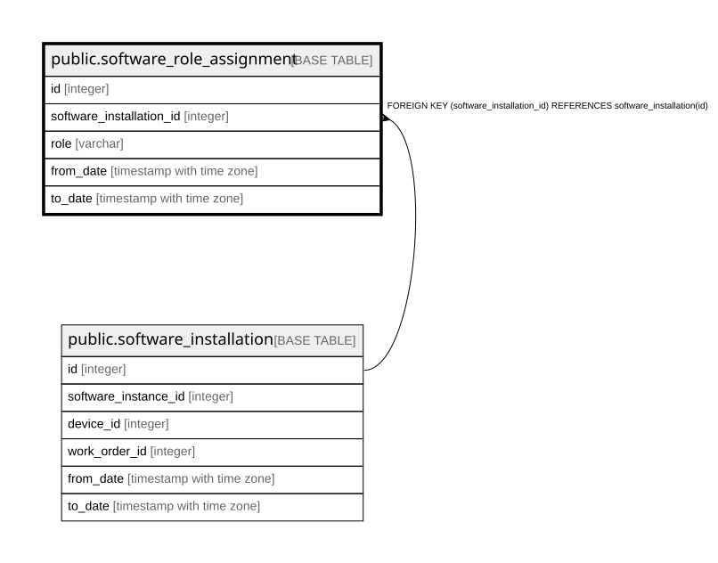

# public.software_role_assignment

## Description

ソフトウェアの役割 — 履歴テーブル（9.9）。**SBOM取込の対象外で、常に運用者が画面上で設定する。**  
1つのインストールに複数のroleを付与できる（dnsmasqのようにDNSとDHCPを兼ねる場合）。  

## Columns

| Name | Type | Default | Nullable | Children | Parents | Comment |
| ---- | ---- | ------- | -------- | -------- | ------- | ------- |
| id | integer |  | false |  |  |  |
| software_installation_id | integer |  | false |  | [public.software_installation](public.software_installation.md) |  |
| role | varchar |  | false |  |  |  |
| from_date | timestamp with time zone |  | false |  |  |  |
| to_date | timestamp with time zone |  | true |  |  | null が現在有効な行 |

## Constraints

| Name | Type | Definition |
| ---- | ---- | ---------- |
| software_role_assignment_software_installation_id_fkey | FOREIGN KEY | FOREIGN KEY (software_installation_id) REFERENCES software_installation(id) |
| software_role_assignment_pkey | PRIMARY KEY | PRIMARY KEY (id) |

## Indexes

| Name | Definition |
| ---- | ---------- |
| software_role_assignment_pkey | CREATE UNIQUE INDEX software_role_assignment_pkey ON public.software_role_assignment USING btree (id) |
| idx_software_role_assignment_installation | CREATE INDEX idx_software_role_assignment_installation ON public.software_role_assignment USING btree (software_installation_id) |
| uq_software_role_assignment_current | CREATE UNIQUE INDEX uq_software_role_assignment_current ON public.software_role_assignment USING btree (software_installation_id, role) WHERE (to_date IS NULL) |

## Relations

---

> Generated by [tbls](https://github.com/k1LoW/tbls)
