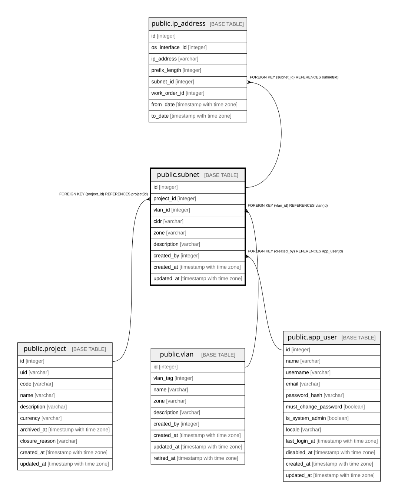

# public.subnet

## Description

サブネット（14.1）。**プロジェクト単位に分ける**ことで、異なるプロジェクトが  
同じプライベートアドレス帯を独立に使っていても衝突しない（14.2）。  

## Columns

| Name | Type | Default | Nullable | Children | Parents | Comment |
| ---- | ---- | ------- | -------- | -------- | ------- | ------- |
| id | integer |  | false | [public.ip_address](public.ip_address.md) |  |  |
| project_id | integer |  | true |  | [public.project](public.project.md) | 共有バックボーン等は null |
| vlan_id | integer |  | true |  | [public.vlan](public.vlan.md) |  |
| cidr | varchar |  | false |  |  |  |
| zone | varchar |  | true |  |  | VLAN側にも持つ。**両方あるときはこちらを優先する**（14.2） |
| description | varchar | ''::character varying | false |  |  |  |
| created_by | integer |  | false |  | [public.app_user](public.app_user.md) |  |
| created_at | timestamp with time zone |  | false |  |  |  |
| updated_at | timestamp with time zone |  | false |  |  |  |

## Constraints

| Name | Type | Definition |
| ---- | ---- | ---------- |
| subnet_cidr_not_null | n | NOT NULL cidr |
| subnet_created_at_not_null | n | NOT NULL created_at |
| subnet_created_by_not_null | n | NOT NULL created_by |
| subnet_description_not_null | n | NOT NULL description |
| subnet_id_not_null | n | NOT NULL id |
| subnet_updated_at_not_null | n | NOT NULL updated_at |
| subnet_created_by_fkey | FOREIGN KEY | FOREIGN KEY (created_by) REFERENCES app_user(id) |
| subnet_project_id_fkey | FOREIGN KEY | FOREIGN KEY (project_id) REFERENCES project(id) |
| subnet_vlan_id_fkey | FOREIGN KEY | FOREIGN KEY (vlan_id) REFERENCES vlan(id) |
| subnet_pkey | PRIMARY KEY | PRIMARY KEY (id) |

## Indexes

| Name | Definition |
| ---- | ---------- |
| subnet_pkey | CREATE UNIQUE INDEX subnet_pkey ON public.subnet USING btree (id) |
| idx_subnet_project | CREATE INDEX idx_subnet_project ON public.subnet USING btree (project_id) |
| idx_subnet_vlan | CREATE INDEX idx_subnet_vlan ON public.subnet USING btree (vlan_id) |
| idx_subnet_created_by | CREATE INDEX idx_subnet_created_by ON public.subnet USING btree (created_by) |

## Relations

---

> Generated by [tbls](https://github.com/k1LoW/tbls)
