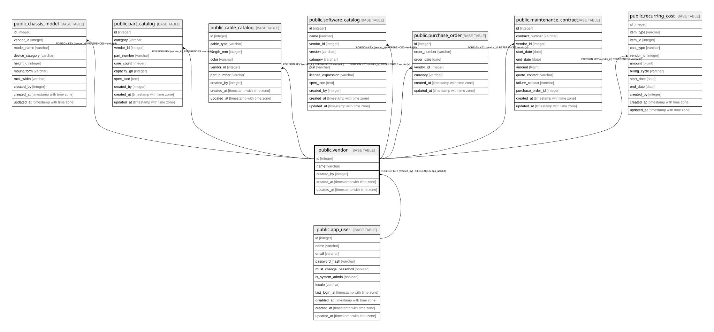

# public.vendor

## Description

ベンダーのマスタ。**名称の表記ゆれを防ぐために存在する**（18.3）。

## Columns

| Name | Type | Default | Nullable | Children | Parents | Comment |
| ---- | ---- | ------- | -------- | -------- | ------- | ------- |
| id | integer |  | false | [public.chassis_model](public.chassis_model.md) [public.part_catalog](public.part_catalog.md) [public.cable_catalog](public.cable_catalog.md) [public.software_catalog](public.software_catalog.md) |  |  |
| name | varchar |  | false |  |  |  |
| created_by | integer |  | false |  | [public.app_user](public.app_user.md) |  |
| created_at | timestamp with time zone |  | false |  |  |  |
| updated_at | timestamp with time zone |  | false |  |  |  |

## Constraints

| Name | Type | Definition |
| ---- | ---- | ---------- |
| vendor_created_by_fkey | FOREIGN KEY | FOREIGN KEY (created_by) REFERENCES app_user(id) |
| vendor_pkey | PRIMARY KEY | PRIMARY KEY (id) |
| vendor_name_key | UNIQUE | UNIQUE (name) |

## Indexes

| Name | Definition |
| ---- | ---------- |
| vendor_pkey | CREATE UNIQUE INDEX vendor_pkey ON public.vendor USING btree (id) |
| vendor_name_key | CREATE UNIQUE INDEX vendor_name_key ON public.vendor USING btree (name) |

## Relations

---

> Generated by [tbls](https://github.com/k1LoW/tbls)
