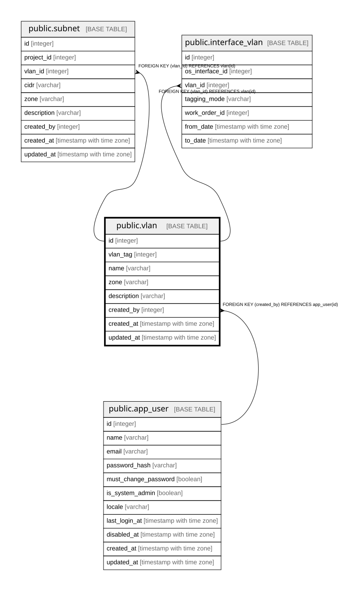

# public.vlan

## Description

VLAN（8.3）。**一意制約を張っていない。**VLANタグはL2ドメインごとに独立しており、  
拠点が違えば同じタグを使える。  

## Columns

| Name | Type | Default | Nullable | Children | Parents | Comment |
| ---- | ---- | ------- | -------- | -------- | ------- | ------- |
| id | integer |  | false | [public.subnet](public.subnet.md) [public.interface_vlan](public.interface_vlan.md) |  |  |
| vlan_tag | integer |  | false |  |  |  |
| name | varchar | ''::character varying | false |  |  |  |
| zone | varchar |  | true |  |  | DMZ / WAN / LAN / Management / Isolated。セキュリティ境界（8.5）。SUBNET側にも持つ |
| description | varchar | ''::character varying | false |  |  |  |
| created_by | integer |  | false |  | [public.app_user](public.app_user.md) |  |
| created_at | timestamp with time zone |  | false |  |  |  |
| updated_at | timestamp with time zone |  | false |  |  |  |
| retired_at | timestamp with time zone |  | true |  |  |  |

## Constraints

| Name | Type | Definition |
| ---- | ---- | ---------- |
| vlan_created_at_not_null | n | NOT NULL created_at |
| vlan_created_by_not_null | n | NOT NULL created_by |
| vlan_description_not_null | n | NOT NULL description |
| vlan_id_not_null | n | NOT NULL id |
| vlan_name_not_null | n | NOT NULL name |
| vlan_updated_at_not_null | n | NOT NULL updated_at |
| vlan_vlan_tag_not_null | n | NOT NULL vlan_tag |
| vlan_created_by_fkey | FOREIGN KEY | FOREIGN KEY (created_by) REFERENCES app_user(id) |
| vlan_pkey | PRIMARY KEY | PRIMARY KEY (id) |

## Indexes

| Name | Definition |
| ---- | ---------- |
| vlan_pkey | CREATE UNIQUE INDEX vlan_pkey ON public.vlan USING btree (id) |
| idx_vlan_tag | CREATE INDEX idx_vlan_tag ON public.vlan USING btree (vlan_tag) |
| idx_vlan_created_by | CREATE INDEX idx_vlan_created_by ON public.vlan USING btree (created_by) |
| idx_vlan_retired_at | CREATE INDEX idx_vlan_retired_at ON public.vlan USING btree (retired_at) |

## Relations

---

> Generated by [tbls](https://github.com/k1LoW/tbls)
