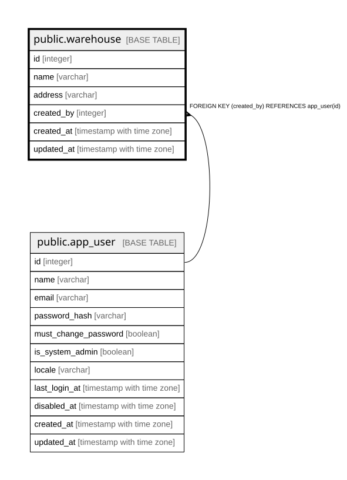

# public.warehouse

## Description

倉庫。プロジェクトを横断する未割当機器の置き場（12章）。

## Columns

| Name | Type | Default | Nullable | Children | Parents | Comment |
| ---- | ---- | ------- | -------- | -------- | ------- | ------- |
| id | integer |  | false |  |  |  |
| name | varchar |  | false |  |  |  |
| address | varchar | ''::character varying | false |  |  |  |
| created_by | integer |  | false |  | [public.app_user](public.app_user.md) |  |
| created_at | timestamp with time zone |  | false |  |  |  |
| updated_at | timestamp with time zone |  | false |  |  |  |

## Constraints

| Name | Type | Definition |
| ---- | ---- | ---------- |
| warehouse_created_by_fkey | FOREIGN KEY | FOREIGN KEY (created_by) REFERENCES app_user(id) |
| warehouse_pkey | PRIMARY KEY | PRIMARY KEY (id) |

## Indexes

| Name | Definition |
| ---- | ---------- |
| warehouse_pkey | CREATE UNIQUE INDEX warehouse_pkey ON public.warehouse USING btree (id) |

## Relations

---

> Generated by [tbls](https://github.com/k1LoW/tbls)
