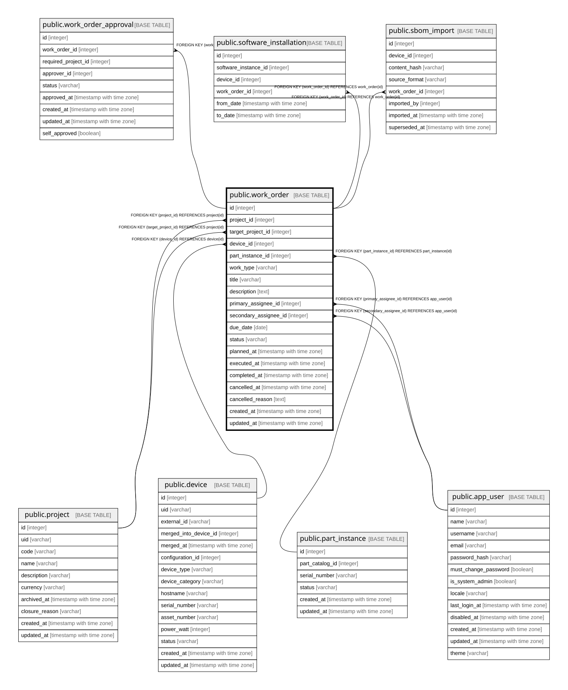

# public.work_order

## Description

変更管理チケット（11章）。**`work_order_id` を持つ履歴テーブルからの外部キーは存在しない**（24.3）。  
SQLiteが後から制約を足せないため。参照整合はアプリケーション層と `dioryga check` で担保する。  

## Columns

| Name | Type | Default | Nullable | Children | Parents | Comment |
| ---- | ---- | ------- | -------- | -------- | ------- | ------- |
| id | integer |  | false | [public.work_order_approval](public.work_order_approval.md) |  |  |
| project_id | integer |  | false |  | [public.project](public.project.md) |  |
| target_project_id | integer |  | true |  | [public.project](public.project.md) | work_type=Transfer の移譲先。それ以外では null |
| device_id | integer |  | true |  | [public.device](public.device.md) |  |
| part_instance_id | integer |  | true |  | [public.part_instance](public.part_instance.md) |  |
| work_type | varchar |  | false |  |  |  |
| title | varchar |  | false |  |  |  |
| description | text |  | false |  |  |  |
| primary_assignee_id | integer |  | true |  | [public.app_user](public.app_user.md) | 主担当。**この人物は自分のチケットを承認できない**（旧C-9、DB制約にできないためアプリケーション層で検証） |
| secondary_assignee_id | integer |  | true |  | [public.app_user](public.app_user.md) |  |
| due_date | date |  | true |  |  | 期日。**実績の `completed_at` とは別に持つ**（5.1。上書きすると予定と実績の差が失われる） |
| status | varchar |  | false |  |  | planned / approved / executing / completed / aborted。 **`approved` は WORK_ORDER_APPROVAL の全行が approved になった結果**であり、単独では動かさない  |
| planned_at | timestamp with time zone |  | true |  |  |  |
| executed_at | timestamp with time zone |  | true |  |  |  |
| completed_at | timestamp with time zone |  | true |  |  |  |
| aborted_at | timestamp with time zone |  | true |  |  |  |
| aborted_reason | text |  | true |  |  |  |
| created_at | timestamp with time zone |  | false |  |  |  |
| updated_at | timestamp with time zone |  | false |  |  |  |

## Constraints

| Name | Type | Definition |
| ---- | ---- | ---------- |
| work_order_primary_assignee_id_fkey | FOREIGN KEY | FOREIGN KEY (primary_assignee_id) REFERENCES app_user(id) |
| work_order_secondary_assignee_id_fkey | FOREIGN KEY | FOREIGN KEY (secondary_assignee_id) REFERENCES app_user(id) |
| work_order_project_id_fkey | FOREIGN KEY | FOREIGN KEY (project_id) REFERENCES project(id) |
| work_order_target_project_id_fkey | FOREIGN KEY | FOREIGN KEY (target_project_id) REFERENCES project(id) |
| work_order_device_id_fkey | FOREIGN KEY | FOREIGN KEY (device_id) REFERENCES device(id) |
| work_order_part_instance_id_fkey | FOREIGN KEY | FOREIGN KEY (part_instance_id) REFERENCES part_instance(id) |
| work_order_pkey | PRIMARY KEY | PRIMARY KEY (id) |

## Indexes

| Name | Definition |
| ---- | ---------- |
| work_order_pkey | CREATE UNIQUE INDEX work_order_pkey ON public.work_order USING btree (id) |
| idx_work_order_project | CREATE INDEX idx_work_order_project ON public.work_order USING btree (project_id) |
| idx_work_order_target_project | CREATE INDEX idx_work_order_target_project ON public.work_order USING btree (target_project_id) |
| idx_work_order_device | CREATE INDEX idx_work_order_device ON public.work_order USING btree (device_id) |
| idx_work_order_part_instance | CREATE INDEX idx_work_order_part_instance ON public.work_order USING btree (part_instance_id) |
| idx_work_order_primary_assignee | CREATE INDEX idx_work_order_primary_assignee ON public.work_order USING btree (primary_assignee_id) |
| idx_work_order_secondary_assignee | CREATE INDEX idx_work_order_secondary_assignee ON public.work_order USING btree (secondary_assignee_id) |
| idx_work_order_status_due | CREATE INDEX idx_work_order_status_due ON public.work_order USING btree (status, due_date) |

## Relations

---

> Generated by [tbls](https://github.com/k1LoW/tbls)
