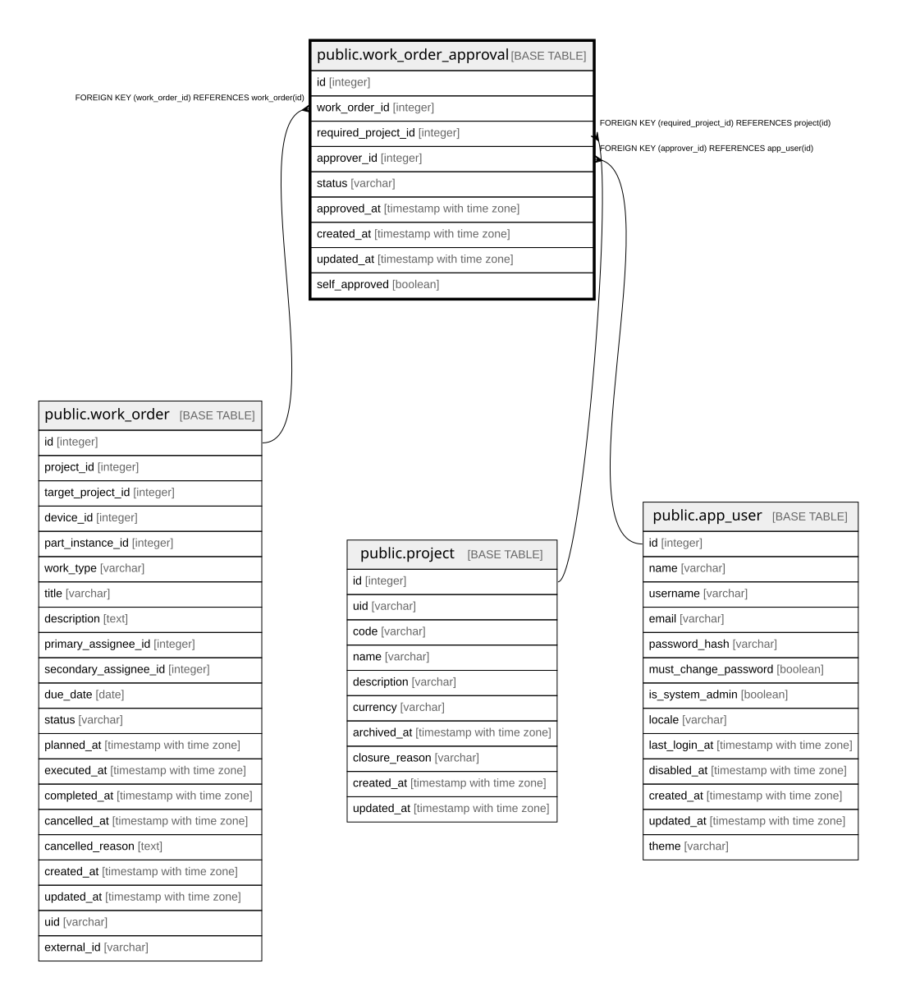

# public.work_order_approval

## Description

変更の承認（11章）。**影響を受けるプロジェクトごとに1行を起こす。**  
他プロジェクトの機器を巻き込む変更（移設・移譲）では複数必要になる。  

## Columns

| Name | Type | Default | Nullable | Children | Parents | Comment |
| ---- | ---- | ------- | -------- | -------- | ------- | ------- |
| id | integer |  | false |  |  |  |
| work_order_id | integer |  | false |  | [public.work_order](public.work_order.md) |  |
| required_project_id | integer |  | false |  | [public.project](public.project.md) | どのプロジェクトの承認か |
| approver_id | integer |  | true |  | [public.app_user](public.app_user.md) | 承認前は null。誰が承認したかは押した時点で決まる |
| status | varchar |  | false |  |  | pending / approved / rejected |
| approved_at | timestamp with time zone |  | true |  |  |  |
| created_at | timestamp with time zone |  | false |  |  |  |
| updated_at | timestamp with time zone |  | false |  |  |  |
| self_approved | boolean | false | false |  |  | **承認者が自分自身だった**（11.4-9、22章R-2）。他に承認できる人がいない場合に限り許される。 導出可能に見えるが、承認当時に他の承認者がいなかったという事実は後から人が増えると再現できない  |

## Constraints

| Name | Type | Definition |
| ---- | ---- | ---------- |
| work_order_approval_approver_id_fkey | FOREIGN KEY | FOREIGN KEY (approver_id) REFERENCES app_user(id) |
| work_order_approval_required_project_id_fkey | FOREIGN KEY | FOREIGN KEY (required_project_id) REFERENCES project(id) |
| work_order_approval_work_order_id_fkey | FOREIGN KEY | FOREIGN KEY (work_order_id) REFERENCES work_order(id) |
| work_order_approval_pkey | PRIMARY KEY | PRIMARY KEY (id) |

## Indexes

| Name | Definition |
| ---- | ---------- |
| work_order_approval_pkey | CREATE UNIQUE INDEX work_order_approval_pkey ON public.work_order_approval USING btree (id) |
| idx_work_order_approval_work_order | CREATE INDEX idx_work_order_approval_work_order ON public.work_order_approval USING btree (work_order_id) |
| idx_work_order_approval_approver | CREATE INDEX idx_work_order_approval_approver ON public.work_order_approval USING btree (approver_id) |
| idx_work_order_approval_required_project_status | CREATE INDEX idx_work_order_approval_required_project_status ON public.work_order_approval USING btree (required_project_id, status) |
| uq_work_order_approval_project | CREATE UNIQUE INDEX uq_work_order_approval_project ON public.work_order_approval USING btree (work_order_id, required_project_id) |

## Relations

---

> Generated by [tbls](https://github.com/k1LoW/tbls)
